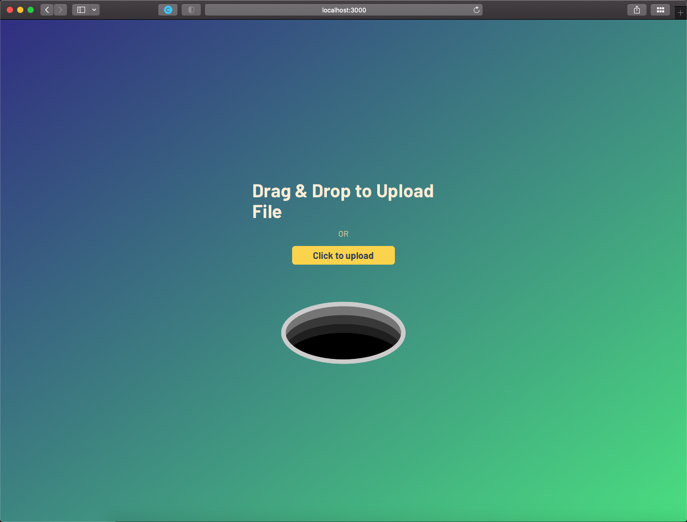

# Burn after reading
Oft times you need to send someone a message or a config file and then you don't want it hang over there forever.
 
This is an open-source dockerized solution to do just that and be in control of your data.

* A simple server that will serve files(messages) only once. And then burn them.
* Includes a GUI to upload files (austere and ascetic as a russian soul)
* Stores data in MongoDB
* Deployed with a container (on any cloud of your preference)
* Data is protected with a password with AES encryption


## Build and run using Docker out-of-the-box

```
npm run docker:build
docker-compose up -d
```
----
## Run (dev):
## Mongo DB DEV container 
./dev-docker-compose/ holds a config to start mongodb container for dev environment 
```
npm run mongo-container
npm start
```
---
## Install (AZURE Static Apps)
1) Create a static app
2) It will create a pipeline that will sit in .github/workflows (check paths and "build" folder)
3) Push to branch main and it will automagically deploy
## Developing
Install deps:
```
npm i
```
Start the mongo container
```
npm run mongo-container
```

Start the app:
```
npm start
```

## A quick docker commands cheatsheet

To build the Docker image:

```bash
npm run docker:build
```

To run the Docker image:

```bash
npm run docker:run
```

To see what Docker images you have locally:

```bash
npm run docker:ls
```
To see what Docker containers you have running:

```bash
npm run docker:ps
```

To stop the container:

```bash
npm run docker:stop
```

This will expose the app on port 3000
Now use it as you wish
```
http://localhost:3000/admin
```